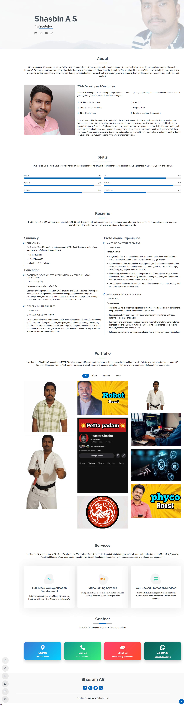

# 🌐 Portfolio Website


A **responsive personal portfolio website** built with **HTML, CSS, and Bootstrap** to showcase projects, skills, and achievements.  
Designed with a **clean layout**, **mobile-first approach**, and smooth navigation for an engaging browsing experience.  


## ✨ Features

- 📱 **Responsive Design** – Optimized for desktops, tablets, and mobile devices  
- 💼 **Projects Showcase** – Highlights web development projects  
- 🛠️ **Skills Section** – Overview of technical expertise  
- 📧 **Contact Section** – Easy access for recruiters and collaborators  
- 🎨 **Modern UI** – Clean and minimal design using Bootstrap  

---

## 🛠️ Technologies Used

- **HTML5** – Structure of the website  
- **CSS3** – Custom styling for layouts and components  
- **Bootstrap 5** – Responsive design and UI components  

---

# 🔗 Links

1. Live Demo : [Portfolio Website](https://shasbinas.github.io/personal-website/)

2. GitHub Repository: [ Portfolio Repo](https://github.com/shasbinas/personal-website.git) 
---
## 📂 Installation & Setup

1. **Clone the repository**
   ```bash
   git clone https://github.com/shasbinas/personal-website.git
   cd personal-website
2. Open the folder in VS Code

3. Install Live Server extension

4. Right-click index.html → Open with Live Server

---

 ## 📸screenshot of website
  
    


---

## ⭐ If you like this project, consider giving it a star on GitHub!